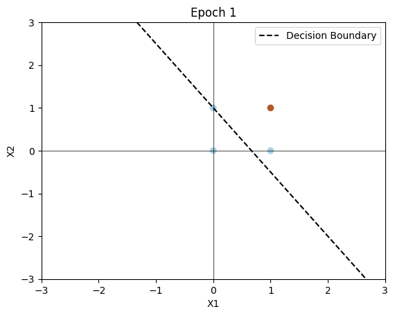
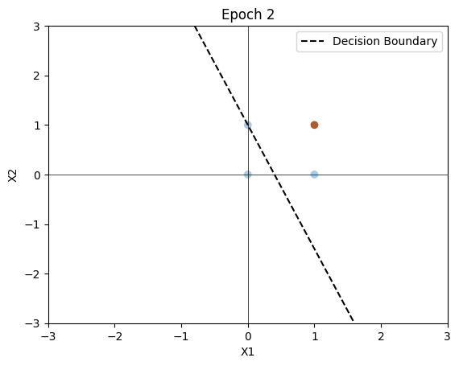
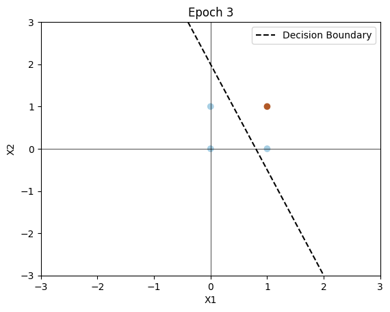
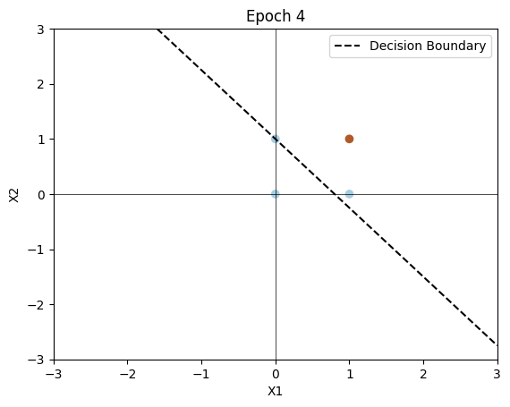
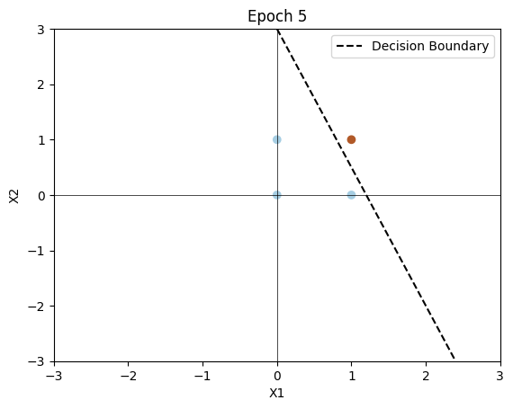

# Perceptron Learning Rule Implementation

This repository contains the implementation of the perceptron learning rule for learning a two-input AND gate. The implementation is in Python, using the NumPy library for numerical computations and the Matplotlib library for plotting.

## Assignment Details

The assignment is part of the course "Edge and Neuromorphic Computing - CSCE790" at the University of South Carolina for the Spring 2024 semester. The goal is to implement the perceptron learning rule and visualize the decision boundary at the end of each epoch.

## Structure

- The report document `perceptron.pdf` provides a detailed explanation of the assignment, including the problem statement, mathematical formulations, Python code, and results.

- The Python code is implemented in the `perceptron.py` file. It includes a `Perceptron` class representing the perceptron, functions for training the perceptron, and plotting decision boundaries.

- Decision boundaries at the end of each epoch are visualized and saved as images (`epoch1.png` to `epoch5.png`).

## Results

The perceptron learning rule was trained for 5 epochs, and the decision boundaries at the end of each epoch are shown below:

- Epoch 1: 
- Epoch 2: 
- Epoch 3: 
- Epoch 4: 
- Epoch 5: 

## How to Run

To run the code and reproduce the results, follow these steps:

1. Clone the repository: `git clone <repository-url>`
2. Navigate to the project directory: `cd <repository-directory>`
3. Run the main Python script: `python perceptron.py`

Feel free to explore and modify the code for your understanding and learning purposes.
